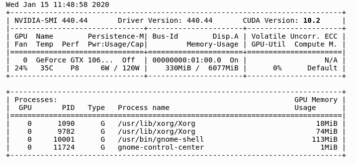

### The first method is to check the version of the Nvidia CUDA Compiler nvcc. To do so execute:

`nvcc --version`

```
nvcc: NVIDIA (R) Cuda compiler driver
Copyright (c) 2005-2019 NVIDIA Corporation
Built on Wed_Oct_23_19:24:38_PDT_2019
Cuda compilation tools, release 10.2, V10.2.89

```

### Given that you have the Nvidia driver installed on your Ubuntu 20.04 system, the following command will also reveal the CUDA version:

`nvidia-smi`



[https://linuxconfig.org/how-to-check-cuda-version-on-ubuntu-20-04-focal-fossa-linux](https://linuxconfig.org/how-to-check-cuda-version-on-ubuntu-20-04-focal-fossa-linux)
