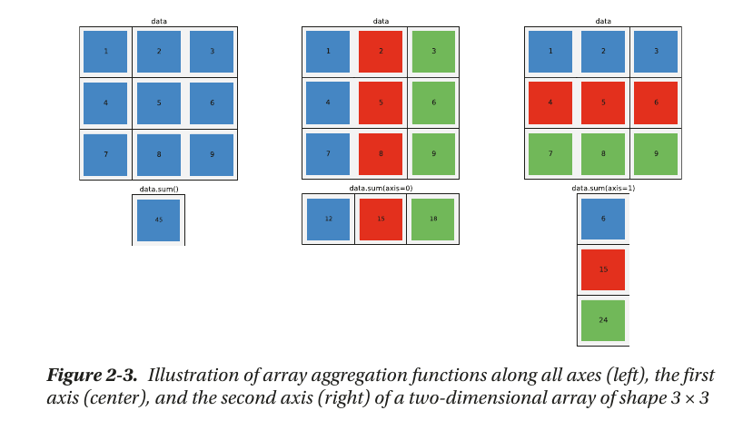

```python
import numpy as np

data = np.arange(1,10).reshape(3,3)
# print(data)

# [[1 2 3]
#  [4 5 6]
#  [7 8 9]]

```



```python
print(data.sum())
# 45

print(data.sum(axis=0))
# [12 15 18]

print(data.sum(axis=1))
# [ 6 15 24]
```
