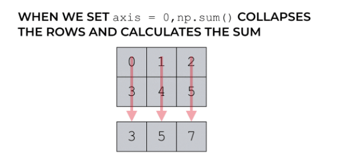
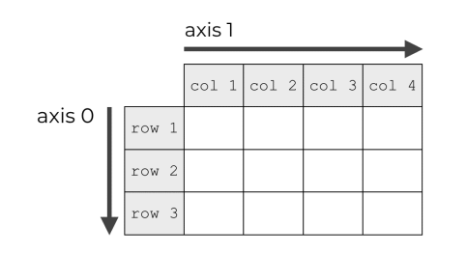
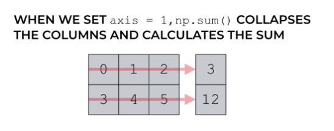

## What may make more sense from a pure programming perspective of action on array elements :

### Axis 0 will act on all the ROWS in each COLUMN

### Axis 1 will act on all the COLUMNS in each ROW

### So a `mean` on axis 0 will be the mean of all the rows in each column, and a mean on axis 1 will be a mean of all the columns in each row.

---

#### NUMPY SUM

Let’s take a look at how NumPy axes work inside of the NumPy sum function.

When trying to understand axes in NumPy sum, you need to know what the axis parameter actually controls.

The axis argument can be an integer, which specifies the axis to aggregate values over.
In many cases the axis argument can also be a tuple of integers, which specifies multiple
axes to aggregate over.

#### In `np.sum()`, the axis parameter controls which axis will be aggregated.

Said differently, the axis parameter controls which axis will be collapsed.

Remember, functions like **sum(), mean(), min(), median()**, and other statistical functions aggregate your data.

### NUMPY SUM WITH AXIS = 0

Here, we’re going to use the NumPy sum function with axis = 0.

First, we’re just going to create a simple NumPy array.

```python
np_array_2d = np.arange(0, 6).reshape([2,3])

```

Lets print to see the whole matrix

```python
print(np_array_2d)
[[0 1 2]
 [3 4 5]]

```

`np_array_2d`, is a 2-dimensional array that contains the values from 0 to 5 in a 2-by-3 format.

Next, let’s use the NumPy sum function with axis = 0.

```python
np.sum(np_array_2d, axis = 0)

```

And here’s the output.

```python
array([3, 5, 7])
```

#### When we set axis = 0, the function actually sums down the columns.

Why? Doesn’t axis 0 refer to the rows?

This confuses many beginners, so let me explain.

### Because, the axis parameter indicates which axis gets collapsed.



### Remember that axis 0 refers to the vertical direction across the rows. That means that the code np.sum(np_array_2d, axis = 0) collapses the rows during the summation.



## So when we set axis = 0, we’re not summing across the rows. Rather we collapse axis 0.

---

## NUMPY SUM WITH AXIS = 1

Again start with our earlier same array `np_array_2d`

```python
print(np_array_2d)
[[0 1 2]
 [3 4 5]]

```

we’re going to use the sum function, and we’ll set the axis parameter to axis = 1.

```python
np.sum(np_array_2d, axis = 1)

```

And here’s the output:

```
array([3, 12])

```

#### So Generally

If you do `.sum(axis=n)`, for example, then dimension `n` is collapsed and deleted, with each value in the new matrix equal to the sum of the corresponding collapsed values. For example, if `b` has shape `(5,6,7,8)`, and you do `c = b.sum(axis=2)`, then axis 2 (dimension with size 7) is collapsed, and the result has shape `(5,6,8)`.

https://stackoverflow.com/a/17079437/1902852

---

### axis 1 refers to the horizontal direction across the columns. That means that the code np.sum(np_array_2d, axis = 1) collapses the columns during the summation.




Source - https://www.sharpsightlabs.com/blog/numpy-axes-explained/
