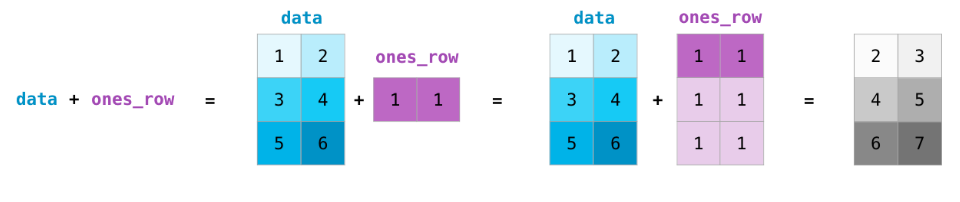

https://jalammar.github.io/visual-numpy/

We can add and multiply matrices using arithmetic operators (+-\*/) if the two matrices are the same size. NumPy handles those as position-wise operations:

We can get away with doing these arithmetic operations on matrices of different size only if the different dimension is one (e.g. the matrix has only one column or one row), in which case NumPy uses its broadcast rules for that operation:

