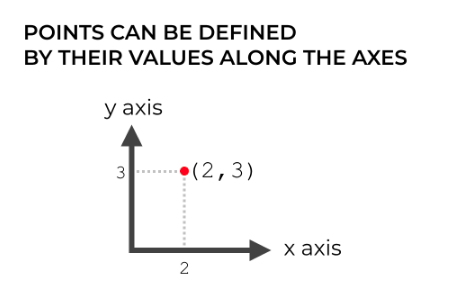

#### NUMPY AXES ARE LIKE AXES IN A COORDINATE SYSTEM

https://www.sharpsightlabs.com/blog/numpy-axes-explained/

So if we have a point at position (2, 3), we’re basically saying that it lies 2 units along the x axis and 3 units along the y axis.

#### NUMPY AXES ARE THE DIRECTIONS ALONG THE ROWS AND COLUMNS

Just like coordinate systems, NumPy arrays also have axes.

In a 2-dimensional NumPy array, the axes are the directions along the rows and columns.

---
