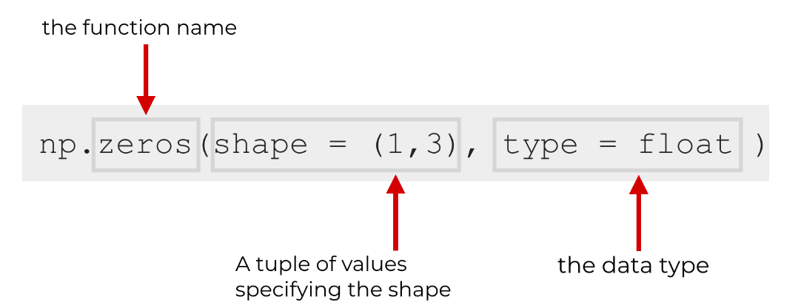
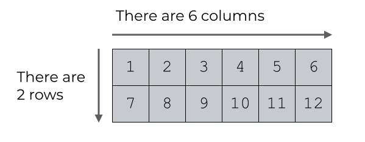
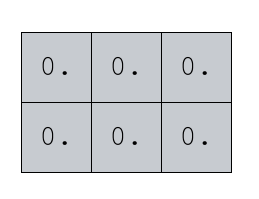
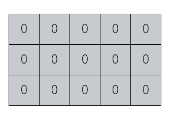
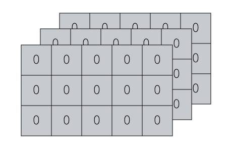

---

##### NumPy zeros() - you can create an array that only contains only zeros using the NumPy zeros() function.

this function enables you to specify the exact dimensions of the array and the data type




##### Source - https://www.sharpsightlabs.com/blog/numpy-zeros-python/

#### First what is Numpy Array

We can create a very simple NumPy array as follows.

```
# we’ve used the NumPy array function to create a 2-dimensional array with 2 rows and 6 columns.

import numpy as np

np.array([[1,2,3,4,5,6],[7,8,9,10,11,12]])

```



#### And now usage of .zeros() function

CREATE A NUMPY ZEROS ARRAY WITH A SPECIFIC SHAPE

We can do this with the shape parameter:

#### Code to generate a Matrix of 2 by 3 (2 rows and 3 columns)

```python
import numpy as np

A = np.zeros(shape = (2, 3))
print

# Output below
[[0. 0. 0.]
 [0. 0. 0.]]

```

Which produces an array like the following:



#### create a NumPy zeros array with a specific shape and a specific

```python

np.zeros(shape = (3, 5), dtype = 'int')

# Output
[[0 0 0 0 0]
 [0 0 0 0 0]
 [0 0 0 0 0]]
```

##### Will produce



---

#### More complex shape

```python
A = np.zeros(shape = (2, 3, 5), dtype = 'int')

# Output

[[[0 0 0 0 0]
  [0 0 0 0 0]
  [0 0 0 0 0]]

 [[0 0 0 0 0]
  [0 0 0 0 0]
  [0 0 0 0 0]]]

```

1. The first parameter to shape is the number of internal elements

So here I have total 2 internal arrays

2. The second and third parameters are just the row \* column numbers of the inner array. So here I have 3 rows and 5 columns


