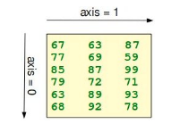

#### Shape of an Array



The function "shape" returns the shape of an array. The shape is a tuple of integers. These numbers denote the lengths of the corresponding array dimension. In other words: The "shape" of an array is a tuple with the number of elements per axis (dimension). In our example, the shape is equal to (6, 3), i.e. we have 6 lines and 3 columns.

##### The shape of an array tells us also something about the order in which the indices are processed, i.e. first rows, then columns and after that the further dimensions.

```python
x = np.array([ [67, 63, 87],
               [77, 69, 59],
               [85, 87, 99],
               [79, 72, 71],
               [63, 89, 93],
               [68, 92, 78]])

print(np.shape(x))
# (6, 3)

```

There is also an equivalent array property:

```python
print(x.shape)
# (6, 3)
```

"shape" can also be used to change the shape of an array.

```python
x.shape = (3, 6)
print(x)
```

```
[[67 63 87 77 69 59 85 87 99]
 [79 72 71 63 89 93 68 92 78]]
```

#### You might have guessed by now that the new shape must correspond to the number of elements of the array, i.e. the total size of the new array must be the same as the old one. We will raise an exception, if this is not the case.

Let's look at some further examples.

The shape of a scalar is an empty tuple:

```python
x = np.array(11)
print(np.shape(x))
()


B = np.array([ [[111, 112, 113], [121, 122, 123]],
               [[211, 212, 213], [221, 222, 223]],
               [[311, 312, 313], [321, 322, 323]],
               [[411, 412, 413], [421, 422, 423]] ])

print(B.shape)
(4, 2, 3)
```
