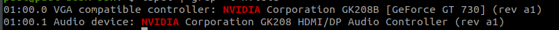

## What is CUDA ? And why we need it to perform TensorFlow's computation with GPU?

**CUDA (Compute Unified Device Architecture)** is a parallel computing platform and programming model developed by Nvidia on its own GPUs (graphics processing units). GPU is designed exclusively for number crunching, and is idea on performing a single task on multiple pieces of data. CUDA enables developers to speed up compute-intensive applications by harnessing the power of GPUs for the parallelizable part of the computation.

Previously this cores only served the purpose of rendering the Graphics but since High computing requirement has arisen, Nvidia made a way to use this cores in a way GPGPU(General Purpose GPU) Computing.

These CUDA cores are indeed very slow compared to the cores of CPUs but they are available in abundance(normal CPU cores: 4–16 vs Normal GPU cores: 128–384) in GPU. So one can use these cores concurrently in parallel computing to enhance the performance of the application or program.

Addition to that GPUs are very good at SIMD which adds the boost in performance.

Now coming to your second question”Why do we actually need it?”. We need it because it’s an interface of communication between your application/program and GPUs. Nvidia has already implemented library called cuDNN which is only for these kind of applications. So using CUDA will give better performance.

## CUDA in deep learning

Deep learning has an outsized need for computing speed. For example, to train the models for [Google Translate in 2016](https://www.nytimes.com/2016/12/14/magazine/the-great-ai-awakening.html), the Google Brain and Google Translate teams did hundreds of one-week TensorFlow runs using GPUs; they had bought 2,000 server-grade GPUs from Nvidia for the purpose. Without GPUs, those training runs would have taken months rather than a week to converge.

In addition to TensorFlow, many other DeepLearnin frameworks rely on CUDA for their GPU support, including Caffe2, CNTK, Databricks, H2O.ai, Keras, MXNet, PyTorch, Theano, and Torch. In most cases they use the cuDNN library for the deep neural network computations.

## What is cuDNN

[According to NVIDIA](https://developer.nvidia.com/cudnn#:~:text=The%20NVIDIA%20CUDA%C2%AE%20Deep,%2C%20normalization%2C%20and%20activation%20layers.)

"The NVIDIA CUDA® Deep Neural Network library (cuDNN) is a GPU-accelerated library of primitives for deep neural networks. cuDNN provides highly tuned implementations for standard routines such as forward and backward convolution, pooling, normalization, and activation layers.

Deep learning researchers and framework developers worldwide rely on cuDNN for high-performance GPU acceleration. It allows them to focus on training neural networks and developing software applications rather than spending time on low-level GPU performance tuning. cuDNN accelerates widely used deep learning frameworks, including Caffe2, Chainer, Keras, MATLAB, MxNet, PyTorch, and TensorFlow. "

## CUDA Toolkit

The CUDA Toolkit includes libraries, debugging and optimization tools, a compiler, documentation, and a runtime library to deploy your applications. It has components that support deep learning, linear algebra, signal processing, and parallel algorithms.

## Important - First check your GPU if its compatible with CUDA

You can use the **`lshw`** command to list the hardware installed on a Linux computer. It reports a variety of types, too—not just PCI hardware.

To tell it to report on the graphics cards it finds, we’ll use the -C (class) option and pass the “display” modifier. The -numeric option forces lshw to provide the numeric IDs of the devices, as well as their names.

Type the following:

`sudo lshw -numeric -C display`

It will give you an output something like below

```
*-display
   description: VGA compatible controller
   product: GP108 [GeForce GT 1030] [10DE:1D01]
   vendor: NVIDIA Corporation [10DE]
   physical id: 0
   bus info: pci@0000:26:00.0
   version: a1
   width: 64 bits
   clock: 33MHz
   capabilities: pm msi pciexpress vga_controller bus_master cap_list rom
   configuration: driver=nouveau latency=0
   resources: irq:97 memory:f6000000-f6ffffff memory:e0000000-efffffff memory:f0000000-f1ffffff ioport:e000(size=128) memory:c0000-dffff
```

Take note of yours, and visit NVidia’s site of GPUs that support CUDA **[here](https://developer.nvidia.com/cuda-gpus)**. If your card is on the list, then you know that TensorFlow can support GPU operations on your machine, but before you can install and run TensorFlow, you’ll need to install the CUDA drivers for your machine and the CUDNN updates for it.

### You can also run

`lspci | grep -i nvidia`


