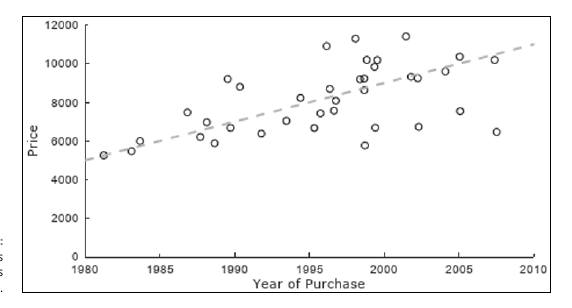
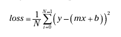

#### First the primer on Linear Regressiion

The first step in TensorFlow training involves choosing an initial expression for the model. For linear regression, this decision is easy. The model
is a line whose equation is y mx b, where m is the line’s slope, and b is the y-intercept (the y-value when x equals 0). The goal of linear regression is to deter-mine m and b so that the resulting line best approximates (or fits) the set of points

The loss is also simple to compute. If the graph contains the point (x, y), the ­difference between the system and the model is

```
y - ( mx b )

```



Your goal is to minimize the square of the error. The algorithm computes the mean of the square error. This step is called the minimization of the error. For linear regression is the , also called MSE. Mathematically, it is: Mean Square Error

If the average error is large, it means the model performs poorly and the weights are not chosen properly. To correct the weights, you need to use an optimizer. The traditional optimizer is called . Gradient Descent

The gradient descent takes the derivative and decreases or increases the weight. If the derivative is positive, the weight is decreased. If the derivative is negative, the weight increases. The model will update the weights and recompute the error. This process is repeated until the error does not change anymore. Each process is called an . Besides, the gradients are multiplied by a learning rate. It indicates the speed of iteration the learning.

If the learning rate is too small, it will take a very long time for the algorithm to converge (i.e requires lots of iterations). If the learning rate is too high, the algorithm might never converge.

In machine learning applications, values of the loss should always have the same sign. You can make sure all the loss values are positive by computing the square of the error at each point and take the average of the error values. If there are N points, you can compute the loss with the following equation:



This method of computing loss is called the mean-squared error, or MSE. In TensorFlow, you can compute it by calling the reduce_mean function. The following code shows how this function is used:

```py
model = tf.add(tf.multiply(m, x), b)
loss = tf.reduce_mean(tf.pow(model - y, 2))

```

And by [TensorFlow docx](https://docs.w3cub.com/tensorflow~python/tf/reduce_mean/) - **`reduce_mean`** has following signature

```py
tf.reduce_mean(
    input_tensor,
    axis=None,
    keepdims=None,
    name=None,
    reduction_indices=None,
    keep_dims=None
)
```

Reduces input_tensor along the dimensions given in axis. Unless keepdims is true, the rank of the tensor is reduced by 1 for each entry in axis. If keepdims is true, the reduced dimensions are retained with length 1.

If axis has no entries, all dimensions are reduced, and a tensor with a single element is returned.

For example:

```py
x = tf.constant([[1., 1.], [2., 2.]])
tf.reduce_mean(x)  # 1.5
tf.reduce_mean(x, 0)  # [1.5, 1.5]
tf.reduce_mean(x, 1)  # [1.,  2.]
```

Having obtained an expression for the loss, the next step is to create an optimizer to minimize the loss. As the optimizer does its work, it will update the variables m and b, thereby obtaining a line that best approximates the change in the Apple Device’s price over time.

To demonstrate this, the following code creates an optimizer, sets its learning rate to 0.1, and calls its minimize method:

```py
optimizer = tf.train.GradientDescentOptimizer(0.1)
opt_op = optimizer.minimize(loss)

```

minimize returns an operation that you can use as the first argument of the session’s run method (see Chapter 5). Note that you must call run repeatedly to ensure that the training converges to suitable values for m and b.
